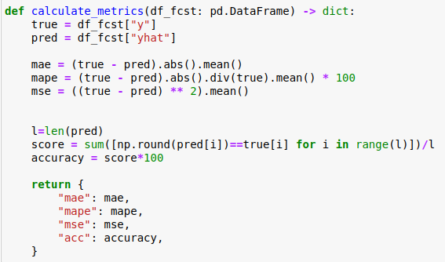

# network-team-project

## 네트워크 융합기술 팀 프로젝트 
### Machine learning-based efficient resource depletion attack detection and reponse techniques  

#### 제안 모델 구현
- 실험 환경 구축
    ##### 1. 데이터 셋 선정
    ##### 2. 데이터 셋 전처리 (메모리 부분 등 추출)
    ###### ~~--> (original) linux_memory. csv: ToN_IoT DATASET~~
    ###### ~~--> (binary) ids_40000.csv: CIC-IDS 2017 DATASET~~
    ###### --> (block) ton_memory.csv: ToN_IoT DATASET 블록화 (공격->정상->공격->정상 .. 10번 반복해서 총 1만개 데이터셋(공격 5천, 정상 5천)
    ##### 3. 분류 모델 구현 (RNN)  
    ###### ~~--> LSTM_try2.ipynb: ToN_IoT DATASET + LSTM~~
    ###### ~~--> LSTM_try2_ids2017.ipynb: CIC-IDS 2017 DATASET + LSTM~~
    ###### ~~--> LSTM block.ipynb: (block) ton_memory.csv + LSTM~~
    ###### --> LSTM block(acc).ipynb: (block) ton_memory.csv + accuracy metric

- 학습 PHASE
    ##### 1. 데이터 전처리 (Feature selection)
    ##### 2. RNN 학습  

- 인증 
    ##### 1. 인증 테이블 구현
    ##### 2. 노드가 입력되면 인증 테이블에 추가, 0->1
    ##### 3. 2. 를 바탕으로 테이블 업데이트  

- 탐지 PHASE
    ##### 1. 기기 모니터링 -test set을 분류 모델에 입력
    ##### 2. 탐지: 메모리 패턴이 RD 공격의 양상을 보이는 경우 (탐지)  

- 대응 PHASE
    ##### 1. 공격으로 탐지된 경우 해당 패킷 drop
    ##### 2. 인증 테이블에서 인증된 사용자 체크
    ##### 3. 해당 사용자 인증 취소(1->0), 블랙리스트 등록  

#### 비교 모델 구현
- 선행 연구 리뷰한 뒤 구체화  

#### Evaluation 
- 탐지율
- Latency
- Memory consumption

#### 코드 수정

    ###### --> Accuracy 부분을 위와 같이 구현한 뒤, 모델 metric 설정 부분을 acc로 수정
